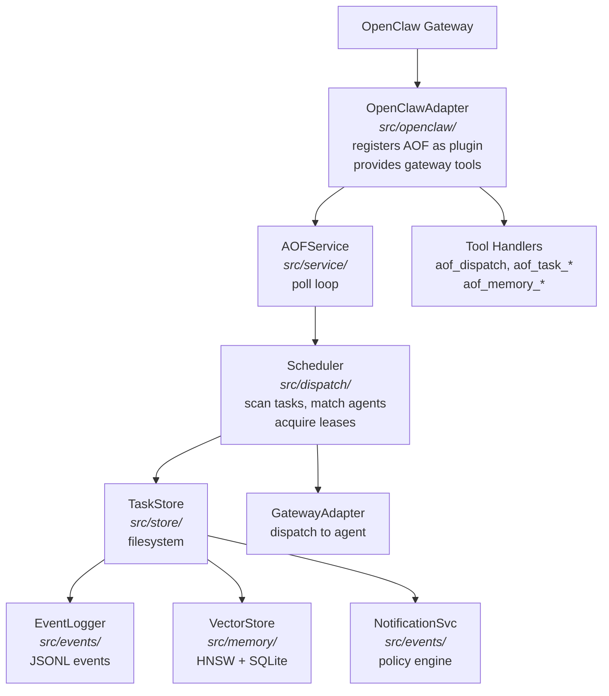
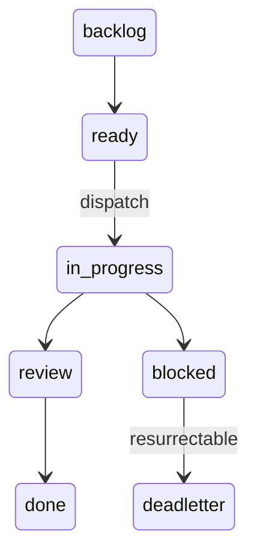

This document gives contributors enough context to navigate the AOF codebase, understand how the major subsystems interact, and identify the right module when making changes.

---

## System Diagram



---

## Key Subsystems

### Dispatch Pipeline

**Location:** `src/dispatch/`

The dispatch pipeline is the heart of AOF. On each poll cycle, the scheduler:

1. **Scans** all tasks across all projects via `FilesystemTaskStore`
2. **Evaluates** gate transitions for tasks in workflow-gated states (via `gate-evaluator.ts`)
3. **Builds dispatch actions** by matching ready tasks to agents using org chart routing rules, capability tags, and priority (via `task-dispatcher.ts`)
4. **Executes actions** by acquiring leases and spawning agent sessions through the `GatewayAdapter` (via `assign-executor.ts` and `action-executor.ts`)

Supporting modules include throttling (`throttle.ts`), SLA checking (`sla-checker.ts`), lease management (`lease-manager.ts`), gate timeout escalation (`escalation.ts`), and failure tracking with deadletter transitions (`failure-tracker.ts`).

The scheduler is deterministic -- it makes no LLM calls. Routing decisions are based on static rules from the org chart and task metadata.

### Task Lifecycle

**Location:** `src/store/`, `src/schemas/task.ts`

Tasks are Markdown files with YAML frontmatter, stored in status-based directories. State transitions are atomic filesystem `rename()` calls -- no database, no race conditions beyond the OS.



Valid transitions are enforced by `VALID_TRANSITIONS` in `src/schemas/task.ts`. The `ITaskStore` interface (`src/store/interfaces.ts`) defines the contract: `create`, `get`, `list`, `transition`, `update`. The `FilesystemTaskStore` (`src/store/task-store.ts`) implements this with filesystem operations.

Task IDs follow the format `TASK-YYYY-MM-DD-NNN`. Leases use TTL-based locking with configurable renewal limits.

### Event Sourcing

**Location:** `src/events/`

Every state transition, dispatch decision, lease operation, and org mutation is recorded as an event. The `EventLogger` (`src/events/logger.ts`) writes one JSON object per line to date-rotated files (`events/YYYY-MM-DD.jsonl`).

Event types (defined in `src/schemas/event.ts`) cover the full lifecycle: `task.created`, `task.transitioned`, `task.assigned`, `dispatch.matched`, `lease.acquired`, `gate_transition`, and many more.

Events feed three consumers:
- **Prometheus metrics** -- counters and histograms via `src/metrics/`
- **Notification engine** -- the `NotificationPolicyEngine` (`src/events/notification-policy/`) evaluates rules to route alerts to channels with deduplication and storm batching
- **Audit trail** -- the raw JSONL files serve as a complete audit log

### Memory

**Location:** `src/memory/`

The memory subsystem provides semantic search over agent knowledge. It uses a three-tier architecture:

- **Hot tier** -- always indexed, available to all agents
- **Warm tier** -- role-scoped, selectively indexed based on org chart roles
- **Cold tier** -- archive, not actively indexed

The core components are:
- `VectorStore` (`src/memory/store/vector-store.ts`) -- SQLite-backed vector storage
- `HnswIndex` (`src/memory/store/hnsw-index.ts`) -- HNSW approximate nearest neighbor index for cosine-similarity search, with incremental inserts and disk persistence
- `FtsStore` (`src/memory/store/fts-store.ts`) -- Full-text search via SQLite FTS5
- `HybridSearchEngine` (`src/memory/store/hybrid-search.ts`) -- Combines vector and BM25 search with configurable weights

Embeddings are generated via pluggable providers (`OpenAIEmbeddingProvider`, Ollama). The `IndexSyncService` watches file paths and keeps the index up to date.

### Daemon

**Location:** `src/daemon/`, `src/service/`

The `AOFService` (`src/service/aof-service.ts`) is the main runtime. It manages a poll loop that invokes the scheduler on a configurable interval. Key responsibilities:

- **Poll loop** -- calls `poll()` from the scheduler on each tick
- **Multi-project discovery** -- discovers projects via `discoverProjects()` and polls each project's task store
- **Protocol routing** -- parses and routes inter-agent protocol messages
- **Graceful shutdown** -- drains in-flight polls with a 10-second timeout

The daemon layer (`src/daemon/daemon.ts`) wraps `AOFService` with:
- PID file locking (prevents duplicate instances)
- Crash recovery detection (stale PID file cleanup)
- HTTP health server on a Unix domain socket (`daemon.sock`)
- OS service file generation (launchd plist on macOS, systemd unit on Linux)

### Projects

**Location:** `src/projects/`

AOF supports multi-project isolation. Each project has its own task store, event log, and memory store. Projects are discovered from the vault root directory (`Projects/<projectId>/`).

Key concepts:
- `ProjectManifest` (`src/schemas/project.ts`) -- per-project `project.yaml` with workflow definitions
- `FilesystemTaskStore` is instantiated per-project with `projectRoot` and `projectId`
- Participant filtering in `assign-executor.ts` ensures agents only receive tasks from projects they participate in

### Protocol System

**Location:** `src/protocol/`

Agents communicate via typed protocol envelopes, not free-form messages. The `ProtocolRouter` (`src/protocol/router.ts`) parses and dispatches protocol messages.

Protocol types include:
- `completion.report` -- task done/blocked/needs_review/partial
- `status.update` -- mid-task progress and work log entries
- `handoff.request` / `handoff.accepted` / `handoff.rejected` -- task delegation
- `resume` -- deterministic re-entry after interruption

---

## Directory Structure

```
src/
  adapters/       Console notifier and other I/O adapters
  cli/            Commander.js CLI entry point and command registrations
    commands/     Individual command modules (task, daemon, org, memory, etc.)
  commands/       Legacy command location (being migrated to cli/commands/)
  config/         Configuration manager (get/set/validate with atomic writes)
  context/        Runtime context and environment detection
  daemon/         Daemon process management (PID lock, health server, service files)
  delegation/     Task delegation logic
  dispatch/       Scheduler, gate evaluator, SLA checker, throttle, lease manager
  drift/          Org chart drift detection (config vs. active agents)
  events/         Event logger (JSONL) and notification policy engine
  gateway/        HTTP handlers for metrics and status endpoints
  integration/    Integration adapters
  mcp/            Model Context Protocol support
  memory/         Vector store, HNSW index, embeddings, tiered memory pipeline
  metrics/        Prometheus exporter and metric collector
  murmur/         Murmur orchestration hooks
  openclaw/       OpenClaw plugin adapter (registers tools, manages lifecycle)
  org/            Org chart loader, linter, and validator
  packaging/      Installer, updater, wizard, migrations, OpenClaw CLI helpers
  permissions/    Permission-aware task store wrapper
  plugins/        Plugin infrastructure
  projects/       Multi-project discovery and isolation
  protocol/       Inter-agent protocol router and message types
  recovery/       Task resurrection, lease expiration, deadletter handling
  schemas/        Zod schemas (task, gate, workflow, org-chart, config, event, project)
  service/        AOFService (poll loop, lifecycle, protocol routing)
  skills/         Skill definitions and management
  store/          Filesystem task store (atomic rename, status directories)
  testing/        Test utilities and helpers
  tools/          OpenClaw tool definitions (aof_dispatch, aof_task_*, aof_memory_*)
  types/          Shared type definitions
  views/          Kanban board and mailbox view generators
```

---

## Key Interfaces

| Interface | Location | Purpose |
|-----------|----------|---------|
| `ITaskStore` | `src/store/interfaces.ts` | Task persistence contract (create, get, list, transition) |
| `GatewayAdapter` | `src/dispatch/executor.ts` | Agent session management (spawn, status, terminate) |
| `TaskContext` | `src/dispatch/executor.ts` | Context passed to agent when dispatching a task |
| `BaseEvent` | `src/schemas/event.ts` | Event log entry structure |
| `OrgChart` | `src/schemas/org-chart.ts` | Org chart document schema |
| `AofConfig` | `src/schemas/config.ts` | AOF runtime configuration schema |
| `Task` / `TaskFrontmatter` | `src/schemas/task.ts` | Task document structure |
| `WorkflowConfig` | `src/schemas/workflow.ts` | Workflow gate definitions |
| `ProjectManifest` | `src/schemas/project.ts` | Per-project configuration |
| `AOFServiceConfig` | `src/service/aof-service.ts` | Service runtime configuration |

---

## Data Flow: Task Creation to Completion

1. **Task created** -- via CLI (`aof task create`) or tool call (`aof_dispatch`). A Markdown file is written to the project's `tasks/ready/` directory.

2. **Scheduler picks up task** -- on the next poll cycle, the scheduler scans `ready/` directories across all projects and builds a list of dispatchable tasks.

3. **Routing** -- the scheduler evaluates routing rules from the org chart. It matches task routing hints (tags, team, agent) against agent capabilities, respecting concurrency limits and throttle settings.

4. **Lease acquisition** -- the scheduler acquires a time-limited lease on the task, preventing double-dispatch. The task file is moved from `ready/` to `in-progress/`.

5. **Agent dispatch** -- the `GatewayAdapter` spawns an agent session (via OpenClaw `sessions_spawn`, `sessions_send`, or CLI) with the task context.

6. **Agent works** -- the agent reads the task file, performs the work, and reports back via protocol messages (`status.update`, `completion.report`).

7. **Gate evaluation** -- if the task has a workflow, the gate evaluator checks whether conditions are met for the next gate transition (e.g., review approval).

8. **Completion** -- the task transitions through `review` to `done`. The lease is released, events are logged, and notifications are sent.

9. **Failure path** -- if the agent fails or the lease expires, the task returns to `ready` for retry. After 3 failures, it moves to `deadletter` for manual intervention.

---

## Extension Points

### Adding a New Tool

1. Create a tool definition in `src/tools/` following the existing pattern (e.g., `aof-tools.ts`)
2. Register it in `src/openclaw/adapter.ts` in the tool list
3. The tool receives an OpenClaw API context and can access the task store, event logger, and memory

### Adding a New Task Type

Tasks are schema-driven. To add new metadata:
1. Extend `TaskFrontmatter` in `src/schemas/task.ts`
2. Update `FilesystemTaskStore` serialization if needed
3. Update the scheduler to handle new routing or lifecycle behavior

### Adding a New Adapter

The `GatewayAdapter` interface (`src/dispatch/executor.ts`) defines three methods: `spawn`, `getSessionStatus`, and `terminateSession`. To add a new dispatch target:
1. Implement the `GatewayAdapter` interface
2. Register it in `src/openclaw/adapter.ts`'s `resolveAdapter` function

### Adding a New Event Type

1. Add the event type string to `EventType` in `src/schemas/event.ts`
2. Emit it via `EventLogger.log()` at the appropriate call site
3. Optionally add a notification rule in `src/events/notification-policy/`
