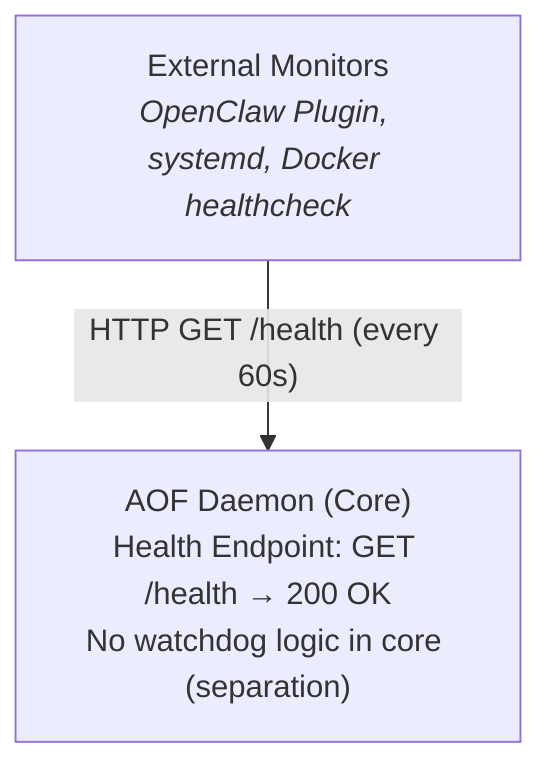

**Task:** AOF-kux  
**Date:** 2026-02-13  
**Author:** swe-architect  
**Status:** Design

---

## Objectives

Implement health monitoring and auto-restart for the AOF daemon to prevent indefinite stalls when the daemon crashes or hangs.

**Key Requirements:**
1. Daemon exposes health check endpoint (`/health`)
2. Watchdog monitors health every 60s
3. Auto-restart daemon on failure (up to 3x in 1hr)
4. After 3 restarts, alert ops team and stop retrying
5. Watchdog must be **optional and pluggable** (no hard OpenClaw dependency)

---

## Architecture Overview



### Separation of Concerns
- **AOF Core:** Exposes health endpoint, no restart logic
- **External Watchdog:** Monitors health, triggers restart, manages retry count
- **Benefits:** AOF remains ejectable, watchdog can be swapped (systemd vs OpenClaw vs Docker)

---

## Component 1: Daemon Health Endpoint

### Location
`src/daemon/health.ts` (new file)

### Interface
```typescript
export interface HealthStatus {
  status: 'healthy' | 'degraded' | 'unhealthy';
  uptime: number;          // milliseconds since start
  lastPollAt: number;      // last scheduler poll timestamp
  lastEventAt: number;     // last event written timestamp
  taskCounts: {
    open: number;
    ready: number;
    inProgress: number;
    blocked: number;
    done: number;
  };
}

export function setupHealthEndpoint(server: Express): void {
  server.get('/health', async (req, res) => {
    const health = await getHealthStatus();
    const httpStatus = health.status === 'healthy' ? 200 : 503;
    res.status(httpStatus).json(health);
  });
}

async function getHealthStatus(): Promise<HealthStatus> {
  // Check: Is scheduler still polling?
  // Check: Can we read/write to tasks directory?
  // Check: Are critical files accessible (org-chart.yaml, etc.)?
  // Return 'healthy' if all checks pass
  // Return 'degraded' if non-critical issues (e.g., slow IO)
  // Return 'unhealthy' if critical failures (e.g., can't read tasks)
}
```

### Health Check Logic
```typescript
function isHealthy(): boolean {
  const now = Date.now();
  const lastPoll = getDaemonState().lastPollAt;
  const lastEvent = getDaemonState().lastEventAt;
  
  // If scheduler hasn't polled in 5min, daemon is unhealthy
  if (now - lastPoll > 5 * 60 * 1000) return false;
  
  // If we haven't written events in 10min, degraded (but maybe no activity)
  // This is a soft signal, not a hard failure
  
  // Try to read tasks directory
  try {
    fs.readdirSync(path.join(process.cwd(), 'tasks'));
  } catch (err) {
    return false; // Can't read tasks → unhealthy
  }
  
  return true;
}
```

### Acceptance Criteria
- `/health` endpoint returns 200 when healthy, 503 when unhealthy
- Health check runs in <50ms (no expensive operations)
- Health status includes: uptime, lastPollAt, lastEventAt, task counts
- Endpoint is exposed when daemon starts (not gated behind auth)

---

## Component 2: OpenClaw Watchdog Plugin

### Location
`plugins/watchdog/` (new directory in AOF repo)

### Purpose
Example watchdog implementation for OpenClaw. Other environments (systemd, Docker) can implement their own using the same `/health` contract.

### Structure
```
plugins/watchdog/
├── index.ts              # Main watchdog logic
├── restart-tracker.ts    # Tracks restart count + timestamps
└── alerting.ts           # Sends alerts to ops channel
```

### Restart Tracker
```typescript
interface RestartTracker {
  restarts: Array<{ timestamp: number; reason: string }>;
  windowMs: number; // 1 hour
  maxRestarts: number; // 3
}

function canRestart(tracker: RestartTracker): boolean {
  const now = Date.now();
  const recentRestarts = tracker.restarts.filter(
    r => now - r.timestamp < tracker.windowMs
  );
  return recentRestarts.length < tracker.maxRestarts;
}

function recordRestart(tracker: RestartTracker, reason: string): void {
  tracker.restarts.push({ timestamp: Date.now(), reason });
  // Prune old restarts outside the window
  const cutoff = Date.now() - tracker.windowMs;
  tracker.restarts = tracker.restarts.filter(r => r.timestamp > cutoff);
}
```

### Watchdog Loop
```typescript
async function watchdogLoop() {
  const tracker: RestartTracker = {
    restarts: [],
    windowMs: 60 * 60 * 1000, // 1 hour
    maxRestarts: 3,
  };
  
  while (true) {
    await sleep(60000); // 60s poll interval
    
    const healthy = await checkDaemonHealth();
    
    if (!healthy) {
      if (canRestart(tracker)) {
        console.log('Daemon unhealthy, restarting...');
        await restartDaemon();
        recordRestart(tracker, 'health check failed');
      } else {
        console.error('Max restarts exceeded, alerting ops team');
        await alertOpsTeam(tracker.restarts);
        break; // Stop watchdog loop
      }
    }
  }
}

async function checkDaemonHealth(): Promise<boolean> {
  try {
    const response = await fetch('http://localhost:3000/health');
    return response.status === 200;
  } catch (err) {
    return false; // Connection failed → unhealthy
  }
}

async function restartDaemon(): Promise<void> {
  // Kill existing daemon process
  // Run: aof-daemon start
  // Wait for /health to return 200
}

async function alertOpsTeam(restarts: Array<{ timestamp: number; reason: string }>): Promise<void> {
  // Send alert to Slack/Discord/email (via org-chart.yaml config)
  // Include: restart history, daemon logs (last 100 lines), task counts
}
```

### Alerting Format
```typescript
interface OpsAlert {
  severity: 'critical';
  title: 'AOF Daemon Auto-Restart Failed';
  body: string; // Markdown-formatted
  metadata: {
    restartHistory: Array<{ timestamp: number; reason: string }>;
    daemonLogs: string; // Last 100 lines
    healthStatus: HealthStatus;
  };
}

function formatAlert(restarts: Restart[], health: HealthStatus): OpsAlert {
  return {
    severity: 'critical',
    title: 'AOF Daemon Auto-Restart Failed',
    body: `
## Summary
The AOF daemon has failed and exceeded the auto-restart limit (3x in 1hr).

## Restart History
${restarts.map(r => `- ${new Date(r.timestamp).toISOString()}: ${r.reason}`).join('\n')}

## Current Health Status
- Uptime: ${health.uptime}ms
- Last Poll: ${new Date(health.lastPollAt).toISOString()}
- Last Event: ${new Date(health.lastEventAt).toISOString()}

## Task Counts
- Open: ${health.taskCounts.open}
- Ready: ${health.taskCounts.ready}
- In Progress: ${health.taskCounts.inProgress}

## Action Required
Manual investigation required. Check daemon logs for root cause.
    `.trim(),
    metadata: { restartHistory: restarts, daemonLogs: '...', healthStatus: health },
  };
}
```

---

## Component 3: Configuration (org-chart.yaml)

```yaml
aof:
  daemon:
    watchdog:
      enabled: true            # Enable OpenClaw watchdog
      pollIntervalMs: 60000    # Health check every 60s
      restartPolicy:
        maxRestarts: 3         # Max restarts in window
        windowMs: 3600000      # 1 hour window
      alerting:
        channel: slack         # slack | discord | email
        webhook: https://hooks.slack.com/...
```

### Default Behavior
- Watchdog is **disabled by default** (opt-in for OpenClaw deployments)
- Standalone AOF runs without watchdog (manual restart via systemd/Docker)
- If `watchdog.enabled: true`, OpenClaw plugin monitors `/health`

---

## Deployment Patterns

### OpenClaw (Plugin)
1. User enables watchdog in `org-chart.yaml`
2. OpenClaw plugin starts watchdog loop
3. Watchdog monitors `/health`, restarts daemon on failure

### systemd (Linux)
```ini
[Unit]
Description=AOF Daemon
After=network.target

[Service]
Type=simple
ExecStart=/usr/local/bin/aof-daemon start
Restart=on-failure
RestartSec=60s
StartLimitInterval=3600
StartLimitBurst=3

[Install]
WantedBy=multi-user.target
```

### Docker (Compose)
```yaml
services:
  aof-daemon:
    image: aof:latest
    restart: unless-stopped
    healthcheck:
      test: ["CMD", "curl", "-f", "http://localhost:3000/health"]
      interval: 60s
      timeout: 10s
      retries: 3
      start_period: 30s
```

---

## Testing Strategy

### Unit Tests
- Health endpoint returns correct status codes (200/503)
- RestartTracker correctly counts restarts within window
- Alert formatting includes all required metadata

### Integration Tests
- Kill daemon process → watchdog restarts it within 60s
- After 3 restarts, watchdog stops and alerts ops team
- Health endpoint survives high load (1000 req/s)

### Gate 2 Validation
- Run integration tests in local dev environment
- Verify restart behavior matches spec

### Gate 3 Validation
- Deploy to staging environment
- Simulate daemon failures (kill process, block scheduler)
- Verify watchdog restarts daemon and alerts ops team

---

## Open Questions

1. **Should health check include disk space?** (e.g., warn if tasks/ directory is >90% full)
2. **Should watchdog send "recovered" alert after successful restart?** (or only alert on max restarts exceeded?)
3. **Should health endpoint require auth token?** (currently public for simplicity)

**Recommendation:** Defer to Phase 2 based on user feedback. Phase 1 focuses on core restart behavior.

---

## Out of Scope (Phase 1)

- Dashboard UI for health status (CLI-only for Phase 1)
- Metrics export (Prometheus, Grafana)
- Configurable health check logic (hardcoded checks for Phase 1)
- Multi-daemon coordination (assumes single daemon per project)

---

## File Change Summary

### New Files
- `src/daemon/health.ts` — Health endpoint implementation
- `plugins/watchdog/index.ts` — Watchdog plugin main logic
- `plugins/watchdog/restart-tracker.ts` — Restart count tracking
- `plugins/watchdog/alerting.ts` — Ops team alerts

### Modified Files
- `src/daemon/server.ts` — Register `/health` endpoint
- `org-chart.yaml` — Add watchdog config section
- `openclaw.plugin.json` — Register watchdog plugin hook

### Test Files
- `tests/daemon/health.test.ts` — Health endpoint unit tests
- `tests/plugins/watchdog.test.ts` — Watchdog logic unit tests
- `tests/integration/daemon-restart.test.ts` — End-to-end restart test

---

## Estimated Effort

- Health endpoint implementation: 0.5d
- Watchdog plugin logic: 1d
- Restart tracker + alerting: 0.5d
- Configuration + docs: 0.5d
- Unit tests: 0.5d
- Integration tests (Gate 2): 1d

**Total:** 3 person-days (backend)

---

## Acceptance Criteria Checklist

- [ ] `/health` endpoint returns 200 when healthy, 503 when unhealthy
- [ ] Health status includes uptime, lastPollAt, lastEventAt, task counts
- [ ] Watchdog monitors health every 60s
- [ ] Daemon auto-restarts on failure (up to 3x in 1hr)
- [ ] After 3 restarts, watchdog alerts ops team and stops retrying
- [ ] Watchdog is **optional** (disabled by default)
- [ ] Watchdog config is in `org-chart.yaml`
- [ ] Alert message includes restart history, daemon logs, health status
- [ ] Integration test: kill daemon → auto-restart within 60s
- [ ] Integration test: 3 restarts → alert ops team, stop retrying
- [ ] Docs: `DEPLOYMENT.md` includes systemd/Docker patterns
