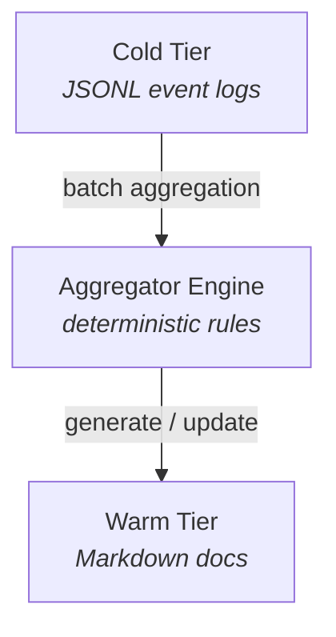

**Version:** 1.0  
**Status:** Draft  
**Author:** swe-architect  
**Date:** 2026-02-07

## Overview

The **Tiered Memory Pipeline** implements a three-tier memory architecture for AOF memory management. It uses **hot/warm/cold** tiers for storage and retrieval. This is not a full tiered system yet; it is a tiered storage model with rule-based aggregation.

Tiers:

- **Cold (Bronze)**: Raw, immutable event logs, transcripts, and incident details
- **Warm (Silver)**: Aggregated, team-scoped operational documents (runbooks, decisions, status)
- **Hot (Gold)**: Canonical, stable core documentation always indexed by agents

## Goals

1. **Reduce token waste** — keep agent context small and relevant
2. **Improve recall quality** — hot docs are authoritative; warm docs are fresh; cold docs are archived
3. **Automatic knowledge propagation** — new decisions/patterns surface in warm tier without manual doc updates
4. **Preserve auditability** — cold tier retains full history for forensics
5. **Sustainable documentation** — hot docs stay <50KB total; no "doc rot"

## Non-Goals (v1)

- LLM-based aggregation (v2 feature)
- Real-time streaming pipeline (batch aggregation is fine)
- Query engine over cold tier (filesystem traversal sufficient)
- Distributed storage (local filesystem only)

---

## Tier Specifications

### Cold Tier (Bronze)

**Purpose:** Immutable historical record of all events, conversations, and incidents.

**Directory structure:**
```
data/memory/cold/
├── logs/           # Event logs (task transitions, leases, system events)
├── transcripts/    # Agent conversation logs, session outputs
└── incidents/      # Error reports, recovery actions, post-mortems
```

**Characteristics:**
- **Write-heavy, read-rarely** — append-only writes
- **Never indexed** by Memory V2 (excluded from `extraPaths`)
- **Timestamped filenames** — ISO8601 format for chronological ordering
- **Retention policy** — compress after 90 days, delete after 1 year (configurable)
- **Size per file** — max 1MB (rotate to new file when exceeded)

**Write APIs:**
```typescript
coldTier.logEvent(event: BaseEvent): Promise<void>
coldTier.logTranscript(sessionId: string, transcript: string): Promise<void>
coldTier.logIncident(incident: IncidentReport): Promise<void>
```

**Example file:**
```
data/memory/cold/logs/2026-02-07T16-30-45-123Z.jsonl
```

**Format:** JSONL (one JSON object per line) for efficient append and grep.

---

### Warm Tier (Silver)

**Purpose:** Aggregated operational knowledge, team-scoped, updated automatically.

**Directory structure:**
```
data/memory/warm/
├── runbooks/       # Living runbooks (updated based on task patterns)
│   ├── swe/
│   │   ├── deploy-backend.md
│   │   └── incident-response.md
│   └── ops/
│       └── monitoring-setup.md
├── decisions/      # Architectural decision records (ADRs), project choices
│   ├── 2026-02-ADR-001-task-artifact-format.md
│   └── 2026-02-ADR-002-memory-tiering.md
├── status/         # Project status updates, sprint summaries
│   └── 2026-02-week1-status.md
└── known-issues/   # Recurring bugs, workarounds, known limitations
    └── 2026-02-known-issues.md
```

**Characteristics:**
- **Read-heavy** — indexed per team via Memory V2 `extraPaths`
- **Periodically updated** — aggregation runs daily or on-demand
- **Deterministic aggregation (v1)** — rule-based (no LLM for initial version)
- **Size per doc** — target <100KB, warn at 150KB
- **Incremental updates** — append new entries, prune old entries beyond retention window

**Aggregation rules (v1):**
1. **Runbooks** — extract common task patterns from cold logs
   - Example: If 5+ tasks of type "deploy" completed successfully, generate/update deploy runbook
2. **Decisions** — compile decision events from task metadata
   - Example: Task with `decision: true` flag → ADR entry
3. **Status** — summarize task completions per team per week
   - Example: Count done tasks, group by priority/project
4. **Known issues** — detect repeated error patterns in incident logs
   - Example: Same error message 3+ times → known issue entry

**CLI command:**
```bash
aof memory aggregate [--dry-run] [--since <date>]
```

**Output:**
```
🔄 Aggregating cold → warm...
  ✅ Processed 1,234 cold events
  ✅ Updated 5 warm docs:
     - runbooks/swe/deploy-backend.md (+12 lines)
     - decisions/2026-02-ADR-003.md (new)
     - status/2026-02-week1-status.md (+3 tasks)
     - known-issues/2026-02-known-issues.md (+1 issue)
  ⚡ Completed in 145ms
```

---

### Hot Tier (Gold)

**Purpose:** Canonical, stable, authoritative core documentation. Always indexed.

**Directory structure:**
```
Resources/OpenClaw/_Core/
├── USER.md            # User identity, name, contact
├── SAFETY.md          # Safety rules, stop conditions
├── RESPONSIBILITIES.md # Agent capabilities, boundaries
└── ESCALATION.md      # When to escalate, who to contact
```

**Characteristics:**
- **Always indexed** — part of every agent's Memory V2 scope
- **Tiny and stable** — total <50KB across all files
- **Updated sparingly** — weekly cadence at most, via gated review
- **High signal** — only essential, non-volatile information

**Promotion workflow:**

1. **Candidate identification** — warm doc becomes stable/authoritative
2. **Review** — human or lead agent approves promotion
3. **Size check** — ensure hot tier stays under 50KB
4. **Diff** — show changes to hot doc before applying
5. **Apply** — atomic update to hot tier
6. **Log** — record promotion event (who, when, why)

**CLI command:**
```bash
aof memory promote \
  --from data/memory/warm/runbooks/swe/deploy-backend.md \
  --to Resources/OpenClaw/_Core/DEPLOY.md \
  --review
```

**Output:**
```
🔍 Reviewing promotion:
  From: data/memory/warm/runbooks/swe/deploy-backend.md (8.2 KB)
  To:   Resources/OpenClaw/_Core/DEPLOY.md (new file)

  Hot tier size: 42.1 KB → 50.3 KB (limit: 50 KB)
  ⚠️  Warning: Hot tier will exceed size limit!

  Diff preview:
  + ## Deploy Runbook
  + Prerequisites: AWS credentials, ...

  Approve promotion? [y/N]: _
```

---

## Integration with Memory V2

**Org Chart memory pools:**

```yaml
memoryPools:
  hot:
    path: Resources/OpenClaw/_Core
    agents: ["all"]  # Always indexed for every agent
  
  warm:
    - id: warm-swe
      path: data/memory/warm/runbooks/swe
      agents: ["role:backend-engineer", "role:frontend-engineer"]
    
    - id: warm-decisions
      path: data/memory/warm/decisions
      agents: ["all"]
    
    - id: warm-status
      path: data/memory/warm/status
      agents: ["team:swe", "role:pm"]
  
  cold: []  # Explicitly not indexed
```

**Generated OpenClaw config:**
```json
{
  "agents": {
    "swe-backend": {
      "memorySearch": {
        "extraPaths": [
          "Resources/OpenClaw/_Core",
          "data/memory/warm/runbooks/swe",
          "data/memory/warm/decisions",
          "data/memory/warm/status"
        ]
      }
    }
  }
}
```

---

## Aggregation Engine (v1)

**Architecture:**


**Aggregator rules (TypeScript):**

```typescript
interface AggregationRule {
  id: string;
  name: string;
  input: {
    tier: "cold";
    path: string;  // e.g., "logs/*.jsonl"
    filter: (event: BaseEvent) => boolean;
  };
  output: {
    tier: "warm";
    path: string;  // e.g., "runbooks/swe/deploy-backend.md"
  };
  aggregate: (events: BaseEvent[], existing: string) => string;
  retention: {
    since?: string;  // ISO date or relative (e.g., "30d")
    limit?: number;  // max events to process
  };
}
```

**Example rule:**

```typescript
const deployRunbookRule: AggregationRule = {
  id: "deploy-runbook",
  name: "Deploy runbook aggregation",
  input: {
    tier: "cold",
    path: "logs/2026-02-*.jsonl",
    filter: (event) => 
      event.type === "task.transitioned" &&
      event.payload.to === "done" &&
      event.payload.taskType === "deploy",
  },
  output: {
    tier: "warm",
    path: "runbooks/swe/deploy-backend.md",
  },
  aggregate: (events, existing) => {
    // Extract common steps, prerequisites, verification
    const steps = events.map(extractSteps).flat();
    const common = findCommonSteps(steps);
    return renderRunbook(common, existing);
  },
  retention: {
    since: "30d",  // Only recent deploys
  },
};
```

**CLI integration:**
```bash
# Run all aggregation rules
aof memory aggregate

# Run specific rule
aof memory aggregate --rule deploy-runbook

# Dry run (preview changes)
aof memory aggregate --dry-run

# Force re-aggregate (ignore timestamps)
aof memory aggregate --force
```

---

## Size Limits & Enforcement

| Tier | File Limit | Total Limit | Enforcement |
|------|------------|-------------|-------------|
| Cold | 1 MB | None (rotate) | Automatic rotation on write |
| Warm | 150 KB (warn) | None | Warning on aggregate; manual review |
| Hot | N/A | 50 KB | Hard block on promotion |

**Monitoring:**
```bash
aof memory stats

# Output:
# Memory Tier Statistics
# ┌──────┬───────┬───────────┬────────┐
# │ Tier │ Files │ Total Size│ Status │
# ├──────┼───────┼───────────┼────────┤
# │ Cold │ 1,234 │ 456 MB    │ OK     │
# │ Warm │    23 │ 2.1 MB    │ OK     │
# │ Hot  │     4 │ 42 KB     │ OK     │
# └──────┴───────┴───────────┴────────┘
```

---

## Rollout Plan

### Phase 4.1.A — Foundation (P4.1-002)
- Implement cold tier write APIs
- Create directory structure
- Add cold tier to `.gitignore` (not versioned)
- Wire into event logger (auto-log all events)

**Acceptance:** `coldTier.logEvent()` works; events written to JSONL

### Phase 4.1.B — Aggregation (P4.1-003)
- Implement aggregation engine
- Define initial rules (runbooks, decisions, status, known-issues)
- CLI command `aof memory aggregate`
- Incremental update logic

**Acceptance:** Aggregation produces warm docs; idempotent

### Phase 4.1.C — Promotion (P4.1-004)
- Implement promotion workflow
- Size limit enforcement
- Diff preview
- CLI command `aof memory promote`

**Acceptance:** Hot docs can be updated; size limits enforced

### Phase 4.1.D — Integration
- Wire aggregation into scheduler (optional: daily cron)
- Update Memory V2 config generation to include warm paths
- Regenerate OpenClaw configs

**Acceptance:** Agents see warm docs in recall; cold excluded

---

## Testing Strategy

### Unit Tests
- Cold tier: write, rotate, timestamp generation
- Warm tier: aggregation rules, incremental updates
- Hot tier: size checks, diff generation, promotion workflow

### Integration Tests
- End-to-end: log event → aggregate → promote
- Memory V2 scoping: verify warm indexed, cold excluded
- CLI commands: all subcommands work

### Acceptance Tests
- Create 100 tasks → verify warm status doc updated
- Log 10 deploys → verify runbook aggregated
- Promote warm→hot → verify size limit enforced

---

## Failure Modes & Mitigations

| Failure | Impact | Mitigation |
|---------|--------|------------|
| Cold tier full disk | Logging fails | Rotation + compression; monitor disk usage |
| Aggregation slow | Stale warm docs | Limit events processed; add timeout |
| Hot tier bloat | Recall degraded | Hard size limit; reject promotions |
| Aggregation rules buggy | Corrupt warm docs | Dry-run preview; rollback mechanism |
| Concurrent aggregation | Race condition | File-based lock (similar to task leases) |

---

## Future Enhancements (v2)

- **LLM-based aggregation** — use GPT to summarize logs into prose
- **Automated promotion** — ML model predicts when warm doc is stable enough for hot
- **Query engine** — SQL or semantic search over cold tier
- **Real-time streaming** — event-driven aggregation (not batch)
- **Distributed cold tier** — S3 or similar for archival

---

## Open Questions

1. **Retention policy details** — compress after 90 days, delete after 1 year?
2. **Aggregation cadence** — daily cron, or on-demand only?
3. **Hot tier governance** — who can approve promotions? Role-based?
4. **LLM aggregation priority** — worth adding in v1, or wait for v2?

**Decision:** For v1, keep simple (deterministic rules, manual approval, on-demand aggregation). Iterate based on usage.

---

## Conclusion

The Memory Medallion Pipeline provides a scalable, deterministic approach to memory management that:
- Keeps agent context lean (hot tier only essential docs)
- Surfaces operational knowledge automatically (warm tier aggregates)
- Preserves full audit trail (cold tier immutable logs)
- Prevents doc rot (hot tier size limits + gated review)

Next steps: implement cold tier (P4.1-002), then aggregation (P4.1-003), then promotion (P4.1-004).
