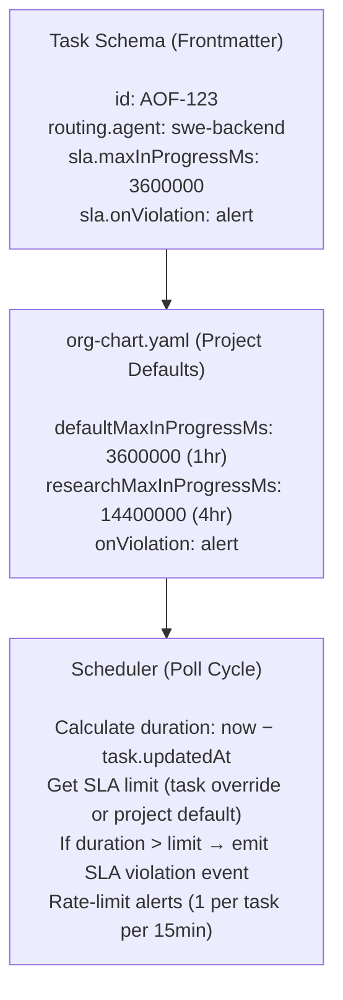

**Task:** AOF-09x, AOF-ae6  
**Date:** 2026-02-13  
**Author:** swe-architect  
**Status:** Design

---

## Objectives

Implement Service Level Agreement (SLA) primitives to detect and alert on tasks that exceed expected in-progress durations. This prevents silent stalls where tasks remain in-progress indefinitely.

**Key Requirements:**
1. Per-task SLA overrides (frontmatter: `sla.maxInProgressMs`)
2. Per-project defaults (org-chart.yaml: `defaultMaxInProgressMs`, `researchMaxInProgressMs`)
3. Scheduler integration (check SLA violations every poll cycle)
4. Alert emission on violation (rate-limited: 1 alert per task per 15min)
5. **Advisory mode only** for Phase 1 (alerts, no blocking)

---

## Architecture Overview



### Data Flow
1. Task transitions to `in-progress` (scheduler dispatches)
2. Scheduler polls every 30s (existing behavior)
3. On each poll, check all `in-progress` tasks for SLA violations
4. If `duration > sla.maxInProgressMs`:
   - Log SLA violation event to `events.jsonl`
   - Emit alert to ops channel (if not rate-limited)
   - Continue polling (no blocking in Phase 1)

---

## Component 1: Task Schema Extension

### Location
`src/types/task.ts` (modify existing)

### Schema Changes
```typescript
export interface Task {
  id: string;
  title: string;
  status: TaskStatus;
  routing?: {
    agent?: string;
    role?: string;
  };
  sla?: {
    maxInProgressMs?: number;  // Per-task override (optional)
    onViolation?: 'alert' | 'block' | 'deadletter'; // Phase 1: only 'alert'
  };
  createdAt: number;
  updatedAt: number;
  // ... existing fields
}
```

### Frontmatter Example
```yaml
---
id: AOF-123
title: Deep research spike
priority: high
routing:
  agent: swe-researcher
sla:
  maxInProgressMs: 14400000  # 4 hours (override default)
  onViolation: alert
---
```

### Validation
```typescript
function validateSLA(sla: Task['sla']): ValidationError[] {
  const errors: ValidationError[] = [];
  
  if (sla?.maxInProgressMs !== undefined) {
    if (sla.maxInProgressMs < 60000) {
      errors.push({ field: 'sla.maxInProgressMs', message: 'Minimum 1 minute' });
    }
    if (sla.maxInProgressMs > 86400000) {
      errors.push({ field: 'sla.maxInProgressMs', message: 'Maximum 24 hours' });
    }
  }
  
  if (sla?.onViolation !== undefined) {
    const valid = ['alert', 'block', 'deadletter'];
    if (!valid.includes(sla.onViolation)) {
      errors.push({ field: 'sla.onViolation', message: `Must be one of: ${valid.join(', ')}` });
    }
  }
  
  return errors;
}
```

---

## Component 2: Project-Level Defaults (org-chart.yaml)

### Configuration Structure
```yaml
aof:
  projects:
    my-project:
      sla:
        defaultMaxInProgressMs: 3600000      # 1 hour (normal tasks)
        researchMaxInProgressMs: 14400000    # 4 hours (research tasks)
        onViolation: alert                   # alert | block | deadletter
        alerting:
          channel: slack                     # slack | discord | email
          webhook: https://hooks.slack.com/...
          rateLimitMinutes: 15               # 1 alert per task per 15min
```

### Default Values (if not configured)
```typescript
const DEFAULT_SLA_CONFIG = {
  defaultMaxInProgressMs: 3600000,      // 1 hour
  researchMaxInProgressMs: 14400000,    // 4 hours
  onViolation: 'alert',
  alerting: {
    rateLimitMinutes: 15,
  },
};
```

### Resolution Logic
```typescript
function getSLALimit(task: Task, project: ProjectConfig): number {
  // 1. Per-task override (highest priority)
  if (task.sla?.maxInProgressMs !== undefined) {
    return task.sla.maxInProgressMs;
  }
  
  // 2. Per-agent research SLA (if agent matches research role)
  if (task.routing?.agent === 'swe-researcher') {
    return project.sla?.researchMaxInProgressMs ?? DEFAULT_SLA_CONFIG.researchMaxInProgressMs;
  }
  
  // 3. Project default
  return project.sla?.defaultMaxInProgressMs ?? DEFAULT_SLA_CONFIG.defaultMaxInProgressMs;
}
```

---

## Component 3: Scheduler Integration

### Location
`src/scheduler/sla-checker.ts` (new file)

### SLA Checker Interface
```typescript
export interface SLAViolation {
  taskId: string;
  title: string;
  duration: number;           // Actual duration (ms)
  limit: number;              // SLA limit (ms)
  agent: string | undefined;  // Assigned agent
  timestamp: number;          // Violation detection time
}

export interface SLAChecker {
  checkViolations(tasks: Task[]): SLAViolation[];
  shouldAlert(taskId: string): boolean; // Rate limiting check
  recordAlert(taskId: string): void;    // Track alert emission
}
```

### Implementation
```typescript
class SLACheckerImpl implements SLAChecker {
  private alertHistory: Map<string, number[]> = new Map(); // taskId → timestamps
  private rateLimitMinutes: number;
  
  constructor(rateLimitMinutes: number = 15) {
    this.rateLimitMinutes = rateLimitMinutes;
  }
  
  checkViolations(tasks: Task[]): SLAViolation[] {
    const now = Date.now();
    const violations: SLAViolation[] = [];
    
    for (const task of tasks) {
      if (task.status !== 'in-progress') continue;
      
      const duration = now - task.updatedAt;
      const limit = getSLALimit(task, getProjectConfig());
      
      if (duration > limit) {
        violations.push({
          taskId: task.id,
          title: task.title,
          duration,
          limit,
          agent: task.routing?.agent,
          timestamp: now,
        });
      }
    }
    
    return violations;
  }
  
  shouldAlert(taskId: string): boolean {
    const now = Date.now();
    const history = this.alertHistory.get(taskId) ?? [];
    
    // Prune old alerts outside rate-limit window
    const cutoff = now - (this.rateLimitMinutes * 60 * 1000);
    const recentAlerts = history.filter(ts => ts > cutoff);
    this.alertHistory.set(taskId, recentAlerts);
    
    return recentAlerts.length === 0; // Only alert if no recent alerts
  }
  
  recordAlert(taskId: string): void {
    const history = this.alertHistory.get(taskId) ?? [];
    history.push(Date.now());
    this.alertHistory.set(taskId, history);
  }
}
```

### Scheduler Modification
```typescript
// In src/scheduler/daemon.ts (existing file)

async function pollCycle(): Promise<void> {
  // Existing dispatch logic
  await dispatchReadyTasks();
  
  // NEW: Check SLA violations
  const inProgressTasks = await loadTasks({ status: 'in-progress' });
  const violations = slaChecker.checkViolations(inProgressTasks);
  
  for (const violation of violations) {
    // Log to events.jsonl
    await logEvent({
      type: 'sla_violation',
      taskId: violation.taskId,
      duration: violation.duration,
      limit: violation.limit,
      timestamp: violation.timestamp,
    });
    
    // Emit alert (if not rate-limited)
    if (slaChecker.shouldAlert(violation.taskId)) {
      await emitSLAAlert(violation);
      slaChecker.recordAlert(violation.taskId);
    }
  }
}
```

---

## Component 4: Alerting

### Alert Format
```typescript
interface SLAAlertPayload {
  severity: 'warning';
  title: string;
  body: string;
  metadata: {
    taskId: string;
    duration: number;
    limit: number;
    agent: string | undefined;
    violationCount: number; // How many times this task has violated SLA
  };
}

function formatSLAAlert(violation: SLAViolation): SLAAlertPayload {
  const durationHrs = (violation.duration / 3600000).toFixed(1);
  const limitHrs = (violation.limit / 3600000).toFixed(1);
  
  return {
    severity: 'warning',
    title: `SLA Violation: ${violation.taskId}`,
    body: `
## Task SLA Exceeded

**Task:** ${violation.taskId} — ${violation.title}  
**Agent:** ${violation.agent ?? 'unassigned'}  
**Duration:** ${durationHrs}h (limit: ${limitHrs}h)  
**Exceeded by:** ${(durationHrs - limitHrs).toFixed(1)}h

## Suggested Actions
1. Check if agent is still active (heartbeat logs)
2. Review task complexity (might need SLA override)
3. Consider manual intervention if task is stuck

View task: \`aof task show ${violation.taskId}\`
    `.trim(),
    metadata: {
      taskId: violation.taskId,
      duration: violation.duration,
      limit: violation.limit,
      agent: violation.agent,
      violationCount: getViolationCount(violation.taskId),
    },
  };
}
```

### Channel Integration
```typescript
async function emitSLAAlert(violation: SLAViolation): Promise<void> {
  const config = getProjectConfig().sla?.alerting;
  if (!config) return; // No alerting configured
  
  const alert = formatSLAAlert(violation);
  
  switch (config.channel) {
    case 'slack':
      await sendSlackWebhook(config.webhook, alert);
      break;
    case 'discord':
      await sendDiscordWebhook(config.webhook, alert);
      break;
    case 'email':
      await sendEmail(config.emailTo, alert);
      break;
  }
}
```

---

## Component 5: CLI Commands

### View SLA Status
```bash
# Show all tasks with SLA violations
aof task sla-violations

# Output:
# ┌───────────┬──────────────────────┬──────────┬────────┬───────────┐
# │ Task ID   │ Title                │ Duration │ Limit  │ Agent     │
# ├───────────┼──────────────────────┼──────────┼────────┼───────────┤
# │ AOF-123   │ Deep research spike  │ 5.2h     │ 4.0h   │ researcher│
# │ AOF-456   │ Backend refactor     │ 2.8h     │ 1.0h   │ backend   │
# └───────────┴──────────────────────┴──────────┴────────┴───────────┘
```

### Override SLA (Per-Task)
```bash
# Set SLA override for specific task
aof task update AOF-123 --sla-limit 8h

# This updates task frontmatter:
# sla:
#   maxInProgressMs: 28800000  # 8 hours
```

---

## Phase 1 Constraints

### Advisory Mode Only
- `onViolation: alert` is the only supported mode
- `block` and `deadletter` modes are Phase 2 scope
- Violations do NOT block task execution or transition

### Why Advisory First?
1. **Tune defaults:** 1hr/4hr might be too aggressive for some projects
2. **Avoid false positives:** Long-running research tasks might need custom SLAs
3. **Gather feedback:** Ops teams can evaluate alert quality before making it blocking

### Phase 2 Expansion
- `onViolation: block` → Transition task to `blocked` status on violation
- `onViolation: deadletter` → Transition task to `deadletter` after repeated violations
- Dashboard UI for SLA violations (current: CLI-only)

---

## Testing Strategy

### Unit Tests
- Task schema validation (min/max SLA limits)
- SLA resolution logic (per-task override > per-agent > per-project)
- Rate limiting logic (1 alert per task per 15min)
- Alert formatting (includes all required metadata)

### Integration Tests
- Create task with SLA override → wait for violation → verify alert emitted
- Create task without SLA → use project default → verify correct limit applied
- Emit 2 alerts within 15min → verify 2nd alert is rate-limited
- SLA violation logged to events.jsonl

### Gate 2 Validation
- Run integration tests in local dev environment
- Verify alerts are emitted to configured channel (Slack/Discord)

### Gate 3 Validation
- Deploy to staging environment
- Simulate long-running tasks (sleep agent)
- Verify SLA violations are detected and alerted

---

## Open Questions

1. **Should SLA limit reset after task updates?** (e.g., if agent updates task description, does duration reset?)
   - **Recommendation:** YES — `updatedAt` timestamp reset indicates active work
2. **Should SLA apply to `blocked` tasks?** (or only `in-progress`?)
   - **Recommendation:** NO — `blocked` is a separate concern (dependency wait time)
3. **Should we track SLA violation count per task?** (for escalation logic)
   - **Recommendation:** YES — include in alert metadata (see formatSLAAlert)

---

## Out of Scope (Phase 1)

- SLA for other statuses (`open`, `ready`, `blocked`)
- SLA for end-to-end task lifecycle (created → done)
- Per-agent SLA overrides (e.g., junior devs get 2x time)
- SLA analytics dashboard (violation trends, per-agent stats)

---

## File Change Summary

### New Files
- `src/scheduler/sla-checker.ts` — SLA violation detection
- `src/alerting/sla-alerts.ts` — Alert formatting and emission
- `src/cli/commands/sla-violations.ts` — CLI command for viewing violations

### Modified Files
- `src/types/task.ts` — Add `sla` field to Task interface
- `src/scheduler/daemon.ts` — Integrate SLA checker into poll cycle
- `src/validation/task-schema.ts` — Add SLA field validation
- `org-chart.yaml` — Add SLA config section

### Test Files
- `tests/scheduler/sla-checker.test.ts` — SLA detection unit tests
- `tests/alerting/sla-alerts.test.ts` — Alert formatting tests
- `tests/integration/sla-violations.test.ts` — End-to-end SLA test

---

## Estimated Effort

- Task schema extension: 0.5d
- SLA checker implementation: 1d
- Scheduler integration: 0.5d
- Alerting implementation: 0.5d
- CLI command (sla-violations): 0.5d
- Unit tests: 0.5d
- Integration tests (Gate 2): 1d

**Total:** 4 person-days (backend)
- AOF-09x (schema): 1d
- AOF-ae6 (scheduler integration): 2d
- AOF-1m9 (alerting): depends on AOF-p3k (deadletter), can run parallel

---

## Acceptance Criteria Checklist

### AOF-09x (Task Schema)
- [ ] Task schema includes `sla.maxInProgressMs` and `sla.onViolation`
- [ ] org-chart.yaml includes project-level SLA defaults
- [ ] SLA resolution logic: per-task > per-agent > per-project
- [ ] Validation: min 1min, max 24hr
- [ ] Unit tests: schema validation, resolution logic

### AOF-ae6 (Scheduler Integration)
- [ ] Scheduler checks SLA violations every poll cycle
- [ ] Duration calculated as `now - task.updatedAt`
- [ ] Violations logged to events.jsonl
- [ ] Alerts emitted to ops channel (Slack/Discord/email)
- [ ] Rate limiting: 1 alert per task per 15min
- [ ] Integration test: task exceeds SLA → alert emitted
- [ ] Integration test: 2nd alert within 15min → rate-limited

### CLI (sla-violations command)
- [ ] `aof task sla-violations` lists all violating tasks
- [ ] Output includes: task ID, title, duration, limit, agent
- [ ] `aof task update <id> --sla-limit <duration>` sets per-task override
