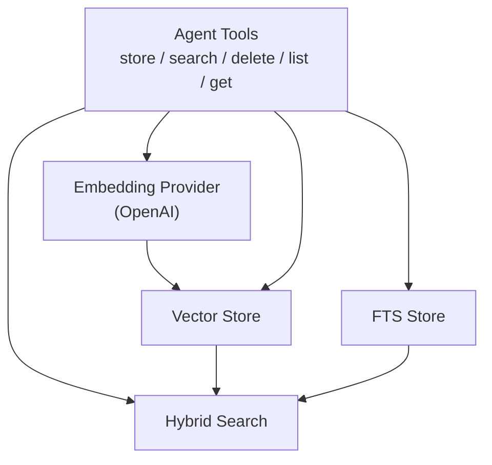

**Last updated**: 2026-02-19
**Status**: Vertical slice complete — stores, embeddings, search, curation, tools all implemented and tested.

## Architecture

The memory module gives AOF agents persistent, searchable knowledge. It follows a three-tier hot/warm/cold model with hybrid search (vector + full-text).



### Tiers

| Tier | Purpose | Lifecycle |
|------|---------|-----------|
| **Hot** | Active working memory — recent, high-relevance | Default for new entries |
| **Warm** | Aggregated knowledge — patterns, summaries | Promoted from hot via `WarmAggregator` |
| **Cold** | Archived incidents, historical context | Demoted from warm via `ColdTier` |

### Key Modules

| Module | Path | Purpose |
|--------|------|---------|
| `index.ts` | `src/memory/index.ts` | Module registration, wires all components |
| **Stores** | `src/memory/store/` | |
| `schema.ts` | | SQLite schema init (tables + FTS5 + vec0) |
| `vector-store.ts` | | Vector similarity search (cosine via sqlite-vec) |
| `fts-store.ts` | | Full-text search (BM25 via FTS5) |
| `hybrid-search.ts` | | Combines vector + FTS scores with tier boosting |
| **Embeddings** | `src/memory/embeddings/` | |
| `provider.ts` | | `EmbeddingProvider` interface |
| `openai-provider.ts` | | OpenAI-compatible embedding client |
| **Tools** | `src/memory/tools/` | |
| `store.ts` | | `memory_store` — ingest, chunk, embed, index |
| `search.ts` | | `memory_search` — hybrid query with ranking |
| `delete.ts` | | `memory_delete` — remove from all indexes |
| `list.ts` | | `memory_list` — enumerate stored documents |
| `get.ts` | | `memory_get` — retrieve specific file content |
| `update.ts` | | `memory_update` — modify existing entries |
| `indexing.ts` | | `IndexSyncService` — background file watcher |
| **Curation** | `src/memory/` | |
| `hot-promotion.ts` | | Rules for hot → warm promotion |
| `warm-aggregation.ts`| | Aggregation policies for warm tier |
| `cold-tier.ts` | | Cold archival + incident reports |
| `curation-policy.ts` | | Configurable curation rules |
| `curation-generator.ts`| | Generates curation configs from templates |

## Configuration

Memory is configured in the AOF plugin config:

```json
{
  "modules": { "memory": { "enabled": true } },
  "memory": {
    "embedding": {
      "provider": "openai",
      "model": "text-embedding-3-small",
      "dimensions": 768
    },
    "poolPaths": {
      "core": "~/.openclaw/aof/memory"
    },
    "defaultPool": "core",
    "defaultTier": "hot",
    "defaultLimit": 20,
    "indexPaths": ["~/.openclaw/workspace/memory"],
    "scanIntervalMs": 1800000
  }
}
```

### Key options

- **`embedding.model`** — Any OpenAI-compatible embedding model
- **`embedding.dimensions`** — Vector dimensions (must match model output)
- **`poolPaths`** — Named directories for storing memory files
- **`indexPaths`** — Directories to watch and auto-index
- **`scanIntervalMs`** — Background sync interval (default: 30 min)

## Usage

### Store a memory

```
memory_store({ content: "The scheduler runs every 30s.", tier: "hot", tags: ["scheduler"] })
```

Writes a markdown file to the pool, chunks it, generates embeddings, and indexes in both vector and FTS stores.

### Search

```
memory_search({ query: "how does the scheduler work", limit: 10 })
```

Runs hybrid search: embeds the query, performs vector similarity + BM25 full-text, combines scores with tier boosting (hot > warm > cold).

### Delete

```
memory_delete({ path: "/path/to/memory-file.md" })
```

Removes the file and all associated chunks from vector and FTS indexes.

### List

```
memory_list({ limit: 20, tier: "hot" })
```

Returns stored documents with path, tier, pool, and timestamp metadata.

## Testing

```bash
# Run all memory tests (147+ tests)
npx vitest run src/memory/

# Run integration test only
npx vitest run src/memory/__tests__/pipeline-integration.test.ts
```

### Test coverage

| Area | Test file | Tests |
|------|-----------|-------|
| Store tool | `memory-store.test.ts` | Write, chunk, index |
| Schema | `store-schema.test.ts` | DB init, re-entrancy |
| FTS | `fts-store.test.ts` | Index, search, delete |
| Vector | `vector-store.test.ts` | Insert, update, delete, KNN |
| Embeddings | `embeddings-provider.test.ts`, `openai-provider.test.ts` | Embed, error handling |
| Search | `memory-search.test.ts` | Query, filter, scoring |
| Hybrid | `hybrid-search.test.ts` | Combined ranking |
| Chunking | `chunker.test.ts` | Markdown splitting |
| Pipeline | `pipeline-integration.test.ts` | End-to-end: store → search → delete |
| Curation | `hot-promotion.test.ts`, `warm-aggregation.test.ts`, `cold-tier.test.ts`, `curation-*.test.ts` | Tier lifecycle |

## Related docs

- [Memory Module Plan](../dev/memory-module-plan.md) -- Architecture decisions and implementation plan
- [Tiered Memory Pipeline](../dev/memory-tier-pipeline.md) -- Hot/warm/cold tier curation pipeline
